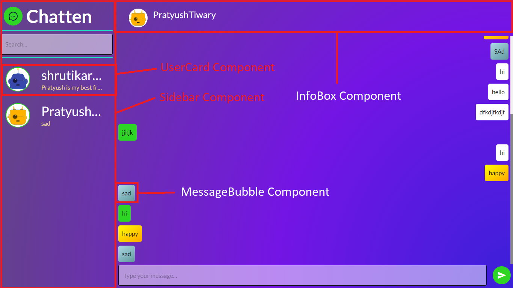

# Chatten

## Installation

Run `npm install`

then to run development server run `npm run dev` on your cmd and goto [http://localhost:3000](http://localhost:3000)

## Libraries Used

- Crypto-js,
- Material-ui
- Axios,
- Framer-motion,
- Socket.io-client,
- Next, &
- React

## Components

The frontend code of this app uses a lot of components, which can be found under `components` directory, components are low level building blocks which when put together makes this app complete, below image shows how components are used.

## Backend Code

[Backend Code Link](https://github.com/pratyushtiwary/chatapp/tree/backend)
