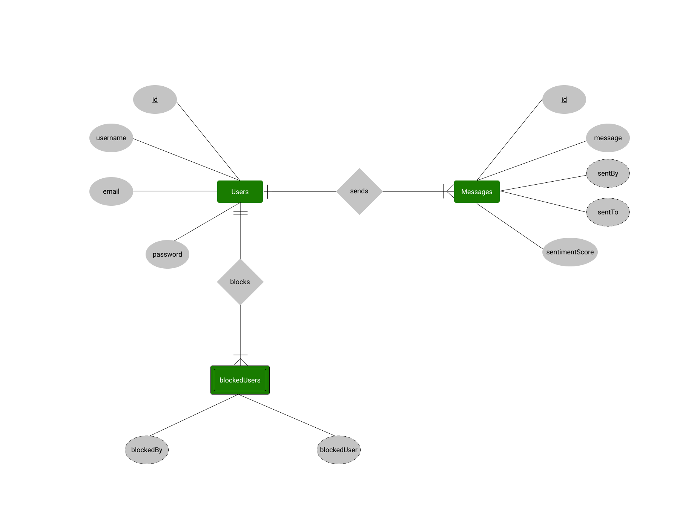
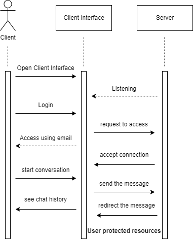
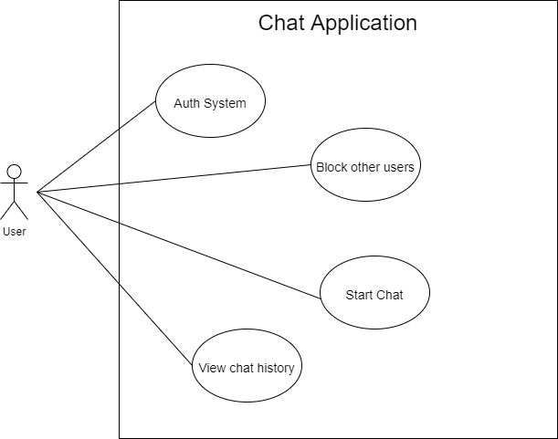

# Chatten Backend

## Installation

Run `npm install` on cmd,

Then run `npm run dev` to start development server

## Features

- Encrypts data,
- Does sentiment analysis in real-time,
- User can be blocked and unblocked

## Diagrams

### ER Diagram

### Sequence Diagram

### Architecture Diagram

### Use Case Diagram

## Packages Used

- Express,
- Socket.io
- CryptoJS,
- Sequelize

## Models

**Note :- Each model is representation of a table in the database**

- User,
- Message,
- BlockedUser

## Controllers

- analyseSentiment,
- blockUser,
- unblockUser,
- fetchChats,
- getUsersList,
- login,
- register,
- search, &
- sendMsg

## FAQ

Q1.) Where can i find the frontend code of this project?

A1.) [Click here to goto the frontend code](https://github.com/pratyushtiwary/chatapp/tree/frontend)

Q2.) Why is there a separate file for server?

A2.) As the project is using Express as well as Socket.io it becomes very tricky to make code look good, so we've decided to move all the server initialization logic to a separate file.

Q3.) What are controllers?

A3.) Controllers are low level function which perform a specific task, like sendMsg controller is used for sending message.

Q4.) What is the different between `controllers` and `utils`?

A4.) `controllers` have access to the database, `utils` don't have access to the database, utils are like code module which are used in many places, whereas controllers are used in their respective places, like for cryptography there is a utils file named`cipher` which is used in many controllers.
